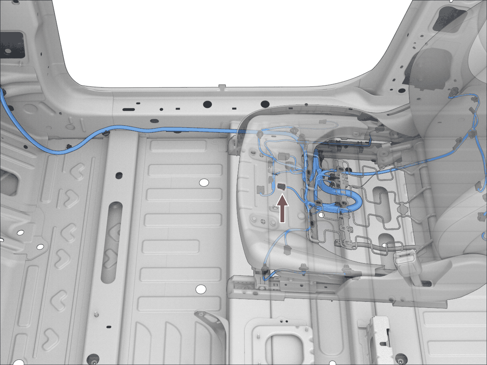
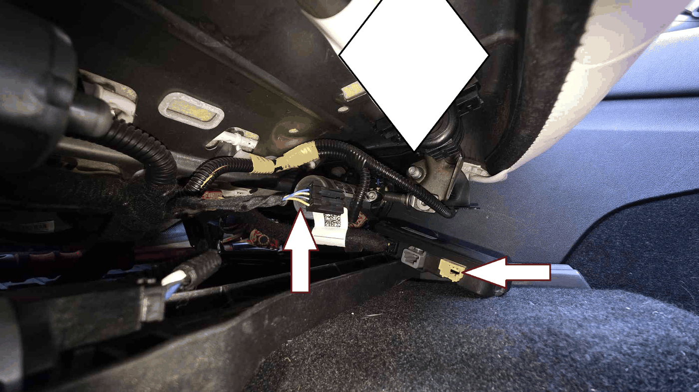
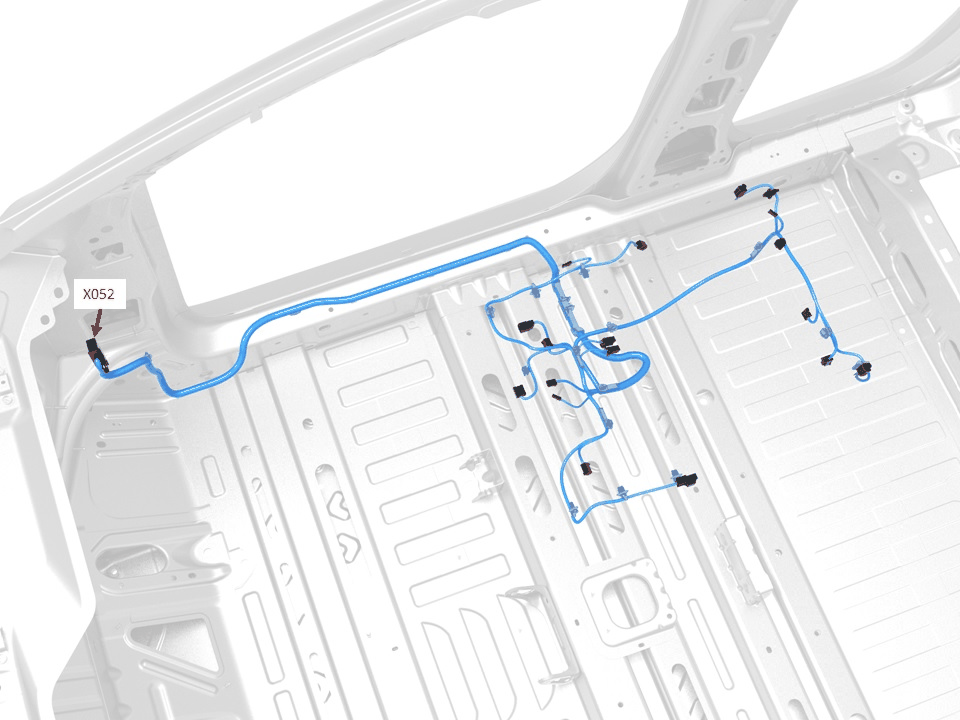
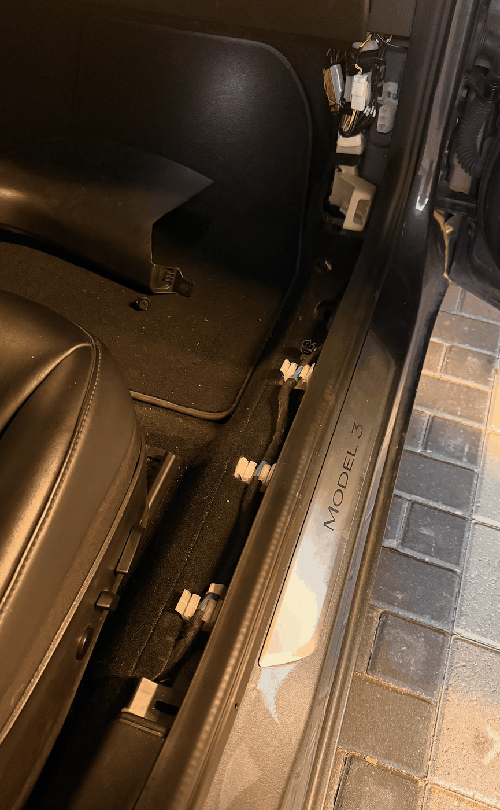
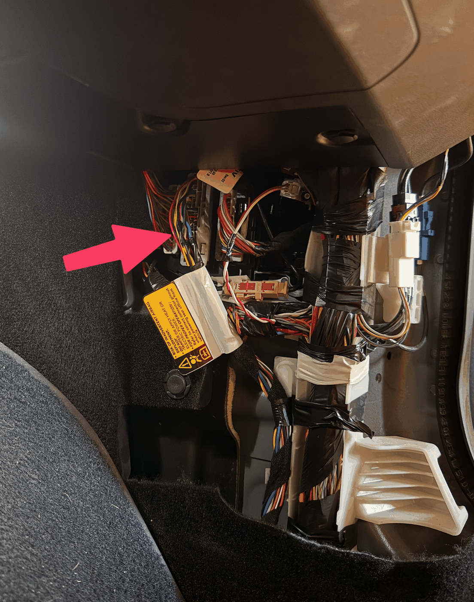
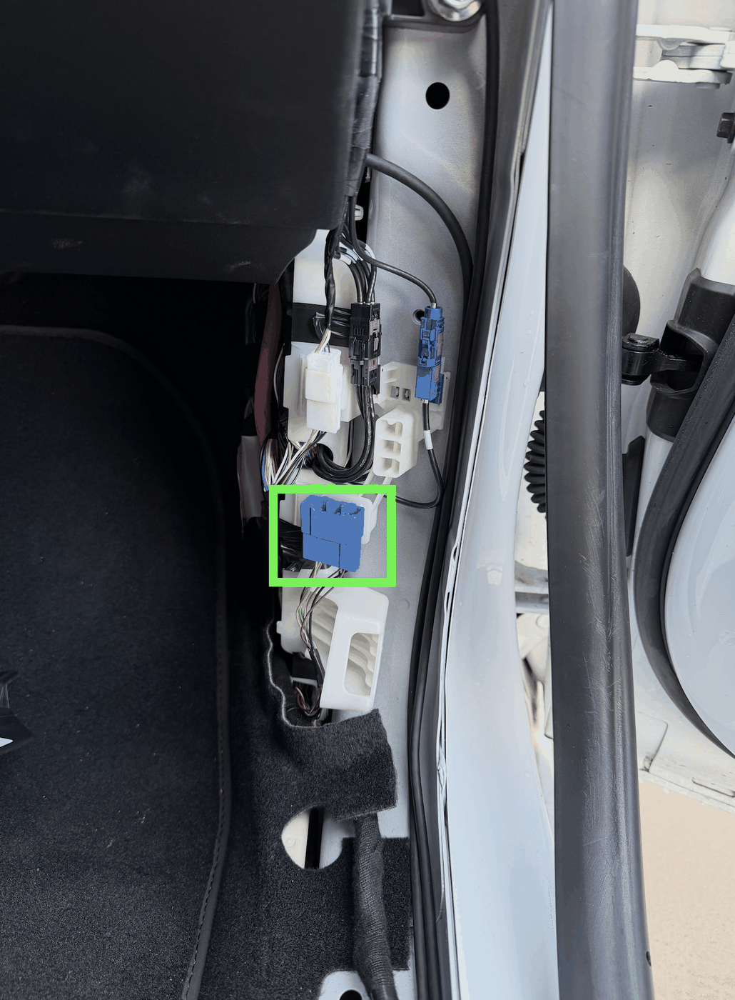
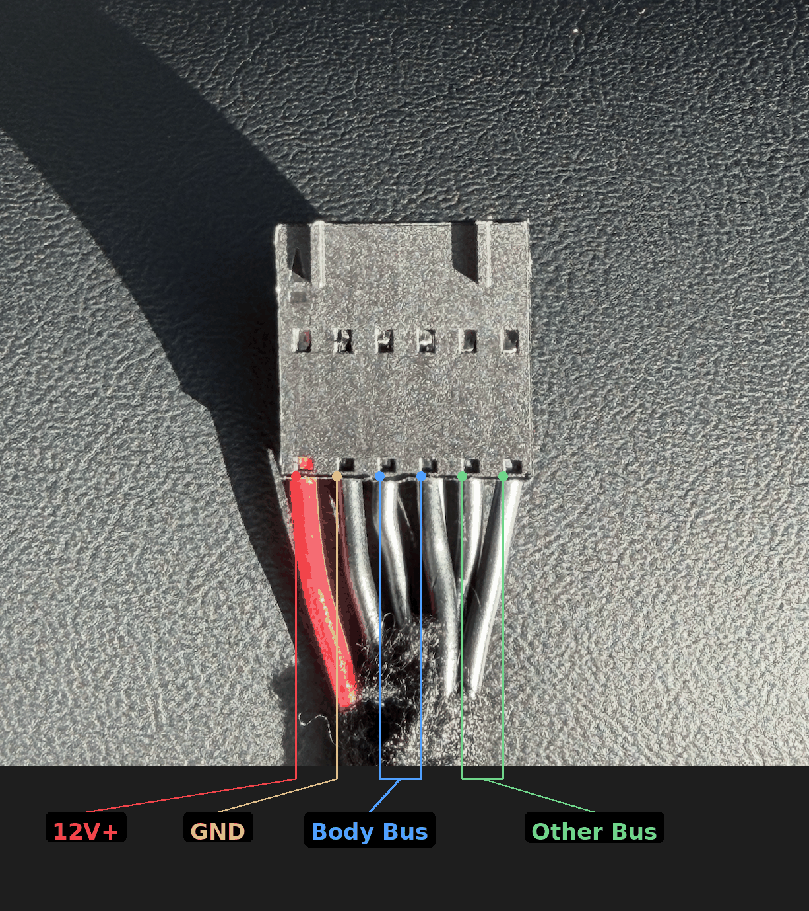
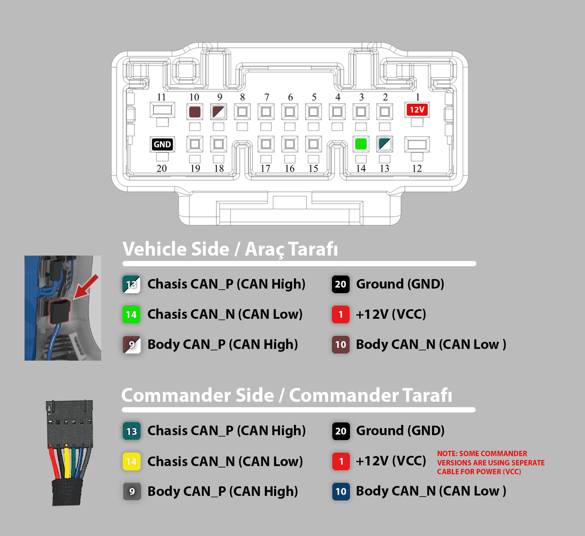
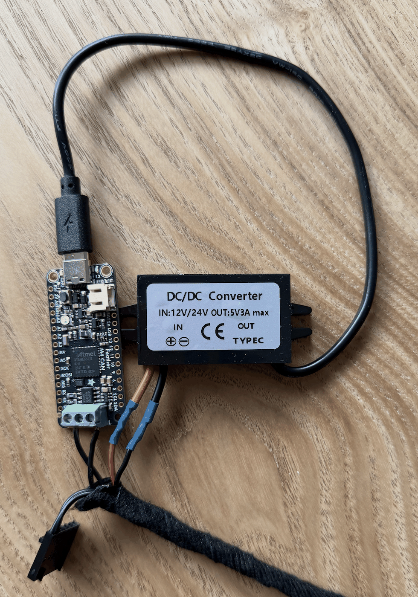

# Finding the right wires for your car

Please use this website for reference to find the right car sheet for your car: <https://service.tesla.com/docs/Model3/ElectricalReference/>

# Wiring Guide: Tesla model 3/y before 2020

There are 3 options:

1. [X652](https://service.tesla.com/docs/Model3/ElectricalReference/prog-20/connector/x652/)
2. [X052](https://service.tesla.com/docs/Model3/ElectricalReference/prog-20/connector/x052/)
3. [X930M](https://service.tesla.com/docs/Model3/ElectricalReference/prog-20/connector/x930m/) (this will not enable FSD!)

## X652

This can be found really easily. Just lift the passenerseat footwell all the way up and look under the seat you will see this:

If it is connected to a black plastic box, please do not use it. If you unplug it the passenger seat warning comes on and stays on. First make a Y splitter cable yourself with these [connectors](https://aliexpress.com/w/wholesale-936119%2525252d1.html)

When connector X652 is present in your car, and there is no black box, it is recommended to use that. Make 2 cables with these [connectors](https://aliexpress.com/w/wholesale-1355717%2525252d1.html) and this [connector](https://aliexpress.com/item/1005008884473620.html?pdp_ext_f=%7B%22order%22%3A%223%22%2C%22eval%22%3A%221%22%2C%22fromPage%22%3A%22search%22%7D)

Pin 1 = CAN-L

Pin 2 = CAN-H

Pin 3 = Ground

Pin 4 = Power

## X052

If pin X652 is not avaible please use X052 which is located near the right side of the car:

there is 1 piece plastic trim that you need to remove. Just pull it near the bottom of the photo up and lift it slowly, near the dashboard there is 1 plastic screw which you can unclip with just your hands. Here you will find the X052 connector:

Since this connector uses special types of plugs that are really deep it is recommended to buy these [connectors](https://aliexpress.com/item/1005008523245081.html) make 4 cables and connect them as follows:

Pin 44: CAN-H

Pin 45: CAN-L

Pin 22: GRN

Pin 20: Power (12v)

Connect them your can device.

# Wiring Guide: Tesla Model 3/Y after 2020

This guide shows how to connect your board to the CAN bus on a Tesla Model 3/Y. The easiest method is using an [Enhance Auto Tesla Gen 2 Cable](https://www.enhauto.com/products/tesla-gen-2-cable?variant=41214470094923) — the same cable used for the Enhance Auto S3XY Commander — which provides both CAN bus data and 12V power through a single connector. Direct wiring to the X179 or X652 connector is also covered.

This guide is board-agnostic — it applies to any board you're using with this project. Photos were taken on a 2023 Model 3 (non-Highland), but the location and procedure should be very similar on other Model 3/Y variants.

## What You Need

| Part | Link |
|---|---|
| Enhance Auto Tesla Gen 2 Cable | [enhauto.com](https://www.enhauto.com/products/tesla-gen-2-cable?variant=41214470094923) |
| 12V/24V to 5V DC/DC Converter (USB-C or Micro-USB, depending on your board) | Various suppliers |

## Step 1: Access the X179 connector

The X179 connector is located on the **passenger side footwell**, behind the panel on the right.

1. Remove the right-side footwell panel trim — it pops off with gentle pulling, no tools required.
2. Locate the connector cluster. The X179 connector is the one highlighted below.

For a video walkthrough of how to access the connector and plug in the cable, see [this installation video by Enhance Auto](https://youtube.com/watch?v=ifwJNZgykVI). Their videos are the best reference for finding and connecting to the X179 port.

> **Note:** Legacy Model 3 vehicles (2020 and earlier) may not have the X179 connector. In that case, use the [**X652 connector**](https://service.tesla.com/docs/Model3/ElectricalReference/prog-187/connector/x652/) — CAN-H on pin 1, CAN-L on pin 2.

## Step 2: Identify the Enhance Auto cable pinout

The Enhance Auto Gen 2 Cable has a connector on one end that plugs into the X179 port, and loose wires on the other end that normally connect to a S3XY Commander. The pinout of the loose end:

| Wire | Signal | Purpose |
|---|---|---|
| Red | 12V+ | Power — connect to DC/DC converter IN+ |
| Black | GND | Power — connect to DC/DC converter IN- |
| Black with stripe | CAN-H (Body Bus) | CAN bus — connect to your board's CAN-H |
| Black solid | CAN-L (Body Bus) | CAN bus — connect to your board's CAN-L |
| Remaining black pair | Other Bus | Not used — leave disconnected |

## Step 3: Connect power and CAN bus

Make sure you have now wired everything like this:

1. Connect the **CAN-H** (black with stripe) and **CAN-L** (black solid) wires to your board's CAN screw terminal or CAN pins.
2. Connect the **12V+** (red) and **GND** (black) wires to your DC/DC converter's input.
3. Connect the DC/DC converter's output (USB-C or Micro-USB) to your board to power it.

> **Important:** If your board or CAN module has an onboard 120 Ohm termination resistor, **cut or remove it** before connecting. The vehicle's CAN bus already has its own termination, and adding a second resistor will cause communication errors.

## Step 4: Plug into the car

Plug the Enhance Auto cable into the X179 connector. It clicks into place — no jumper wires, soldering, or splicing needed.

The cable provides both CAN bus data and 12V power through the single connector, so your board will power on as soon as the car wakes up.

## Wiring without the Enhance Auto cable

If you prefer to wire directly without the Enhance Auto cable, connect to the [**X179 connector**](https://service.tesla.com/docs/Model3/ElectricalReference/prog-233/connector/x179/) pins directly:

| Pin | Signal |
|-----|--------|
| 13  | CAN-H  |
| 14  | CAN-L  |

Note that with direct wiring you will need to provide power separately.
